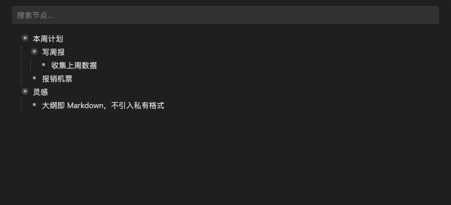

# OutlineNode

[](https://marketplace.visualstudio.com/items?itemName=outlinenode.outline-node)

**English** · [简体中文](README.zh-CN.md)

**A local-first outliner for VS Code, running on plain Markdown files.**



Your notes are just a standard `.md` indented list — Obsidian and Logseq read them directly, and Git diffs stay readable. **No proprietary format, no account, no cloud. Uninstall the extension and your files are still plain Markdown.**

## Features

- **Unlimited nesting** — `Enter` to split, `Tab` / `Shift+Tab` to re-level, `Backspace` to merge
- **Fold / unfold** — folding state lives in VS Code and is **never written to your files**
- **Zoom in** — focus any subtree, with breadcrumb navigation
- **Task checkboxes** — serialized as standard `- [x]`
- **Node notes** — `Shift+Enter` opens a second line, stored as an indented continuation
- **Move and drag** — `Alt+↑/↓` moves a whole subtree; drag with the mouse to reorder across levels
- **Live search filter** — keeps the ancestor chain, sees through folded nodes
- **Inline Markdown** — `` `code` ``, `**bold**`, `==highlight==` and links render as you read; editing keeps lightweight syntax highlighting without changing the plain-text DOM. The link toolbar opens title and URL fields
- **Code blocks** — syntax highlighting for 12 languages, switchable per block, with a copy button; blocks taller than 240px collapse automatically
- **Images** — `![[pic.png]]` and `` render inline; paste a screenshot and it lands in the note's `assets/` folder
- **Sidebar** — top-level navigation and starred nodes, collapsible
- **Multi-select** — shift-click or `Shift+↑/↓` to act on several nodes at once
- **Mirror references** — the same node in several places, edited in sync, using Obsidian's native `^id` / `![[#^id]]` block-embed syntax
- **Full IME support** for Chinese, Japanese and Korean input
- **Undo / redo** delegated to VS Code's native undo stack — no second history to fight with

## Keyboard shortcuts

| Key | Action |
|---|---|
| `Enter` | Split the node at the caret (at the end of an expanded parent: create its first child) |
| `Shift+Enter` | Focus / create the node note; insert a newline inside a note |
| `Tab` / `Shift+Tab` | Indent / outdent |
| `Backspace` (at line start) | Merge with the previous node; an empty parent promotes its children and is removed |
| `Cmd/Ctrl+Shift+Backspace` | Delete the current node or selection (asks before deleting descendants) |
| `Alt+↑` / `Alt+↓` | Move the node up / down, children included |
| `Cmd/Ctrl+Enter` | Toggle done |
| `Alt+→` / `Alt+←` | Zoom into the current node / zoom out one level |
| `Cmd/Ctrl+.` | Fold / unfold the current node |
| `↑` / `↓` | Move to the adjacent node when on the first / last line |
| `Cmd/Ctrl+Z` / `Cmd/Ctrl+Shift+Z` | Undo / redo (VS Code native) |
| `Cmd/Ctrl+F` | Focus the outline search box |
| `Shift+↑` / `Shift+↓` | Extend the node selection |
| `Ctrl+B` / `Ctrl+H` | Bold / highlight the selected text (`Ctrl+Alt+B` / `Ctrl+Alt+H` off macOS) |
| `Ctrl+O` | Hide / show completed nodes (`Ctrl+Alt+O` off macOS) |
| `?` | Show all shortcuts |
| `Esc` | Clear the search / cancel a drag |

Use `Cmd` on macOS, `Ctrl` on Windows and Linux.

The formatting and hide-completed keys deliberately avoid `Cmd+B` / `Cmd+O`: webview keystrokes are handed to the workbench for keybinding resolution, so VS Code's own bindings (toggle sidebar, open file) win no matter what the webview does. The floating toolbar that appears over selected text is the primary entry point for formatting.

A node code block requires a title, but its creation entry is always available: type `/code`, or type a fence on an empty line and press Enter. If the title is still empty, focus stays on the always-visible “title required” row above the new block. You can also type `Parse YAML /code` directly. Existing untitled blocks show the same editable prompt without silently changing the Markdown. The `/` menu contains Code and Numbered List; existing task nodes remain fully supported.

## Usage

- **`*.outline.md`** opens in OutlineNode by default.
- For any other **`*.md`**: click `⋯` in the editor title bar → **Reopen Editor With… → Outline**, or run `OutlineNode: Open as Outline` from the command palette.
- To make every `.md` under a given folder (say `outlines/` in an Obsidian vault) open as an outline, use VS Code's native `workbench.editorAssociations`:

  ```jsonc
  {
    "workbench.editorAssociations": {
      "**/outlines/**/*.md": "outlineNode.outline"
    }
  }
  ```

  Remove the entry to go back to the text editor. Your files are untouched either way.

## Interop with Obsidian / Logseq

What lands on disk is an ordinary Markdown indented list:

```markdown
- This week ^k3f9a2
  - Write the weekly report
    - Collect last week's numbers
  - [x] File the expense
    A note lives on an indented continuation line
- Reference the item above: ![[#^k3f9a2]]
```

- **Obsidian** — `^k3f9a2` is a block id and `![[#^k3f9a2]]` is a block embed, so Obsidian renders it as a real embed. Same meaning on both sides.
- **Logseq and other outliners** — an indented list is the lingua franca; they read it as-is.
- **Git** — one edit produces a diff on the lines you edited, not a reflow of the whole file.

## Settings

| Setting | Default | Description |
|---|---|---|
| `outlineNode.defaultIndent` | `2-space` | Indent unit for new files, or when it can't be detected (`2-space` / `4-space` / `tab`) |
| `outlineNode.rememberFolding` | `true` | Remember folding state across sessions |
| `outlineNode.defaultFold` | `none` | Folding applied when a file opens (`none` / `firstLevel`) |
| `outlineNode.cleanupUnusedImagesOnSave` | `true` | Move unreferenced `pasted-*` images generated by OutlineNode to the trash after saving |

For existing files the indent unit is detected from the content and is never overridden by this setting.

## Design principles

1. **The file is the single source of truth.** The `TextDocument` is the model, so undo, the dirty indicator, saving and hot restore all come from VS Code itself.
2. **Minimal diffs.** An edit rewrites only the lines it touches — no opportunistic reformatting of the rest of the file, which stays byte-for-byte identical.
3. **UI state never hits disk.** Folding, zoom and search live in VS Code. Your `.md` stays clean.

## Contributing

See [AGENTS.md](AGENTS.md) and [docs/](docs/) for the full technical specification.

## License

MIT

Bundled third-party code: [Prism](https://prismjs.com/) (MIT) — syntax highlighting for code blocks, bundled into the webview because the extension's CSP forbids loading anything from a CDN.
